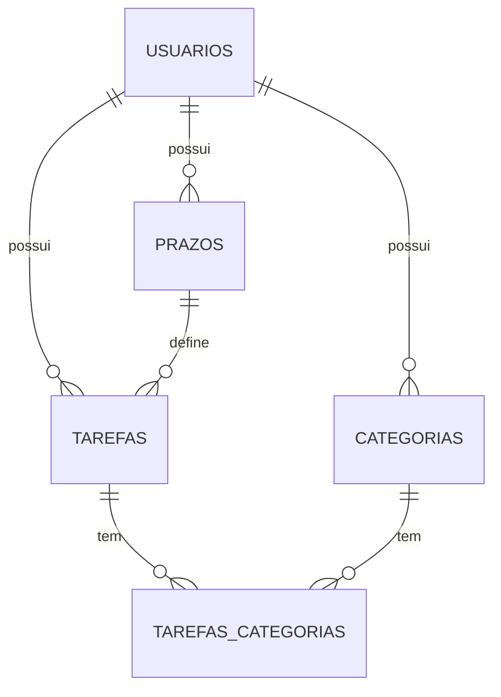

# Modelagem do banco — Jarvis V1

Banco: **PostgreSQL** (Supabase).

Este documento descreve todas as tabelas, campos, tipos, restrições e relacionamentos da V1.

> **Diagrama ER:** veja `esquema.mmd` (Mermaid). Pra visualizar no draw.io:
> 1. Abra https://app.diagrams.net
> 2. Menu **Arrange → Insert → Advanced → Mermaid**
> 3. Cole o conteúdo de `esquema.mmd`
>
> Alternativa: abra o `.mmd` direto em https://mermaid.live pra preview rápido.

---

## Visão geral



**5 tabelas no total:**

| Tabela | Propósito |
|---|---|
| `usuarios` | Cadastro dos usuários (multi-user V1) |
| `categorias` | Rótulos das tarefas, criados pelo usuário |
| `prazos` | Templates de duração ("Hoje", "Amanhã", etc) |
| `tarefas` | Tarefas/anotações do usuário |
| `tarefas_categorias` | Tabela de junção N:N (tarefa ↔ categoria) |

---

## 1. `usuarios`

Usuários do Jarvis. Multi-user desde a V1 (Pedro, sócio e namorada vão testar).

| Campo | Tipo | Nulo? | Default | Descrição |
|---|---|---|---|---|
| `id` | `uuid` | NÃO | `gen_random_uuid()` | PK |
| `nome` | `varchar(100)` | NÃO | — | Nome do usuário, usado pra personalização do tom do Jarvis |
| `email` | `varchar(150)` | NÃO | — | Email (lowercase, único no sistema) |
| `senha_hash` | `varchar(255)` | NÃO | — | Hash BCrypt da senha |
| `criado_em` | `timestamp with time zone` | NÃO | `now()` | Data de cadastro |

**Restrições:**
- PK: `id`
- UNIQUE: `email`
- INDEX: `email` (pra login rápido — unique já cria index automático)

---

## 2. `categorias`

Categorias criadas pelo usuário (antigamente "tag", foi unificado em "categoria"). Uma tarefa pode ter múltiplas (N:N).

| Campo | Tipo | Nulo? | Default | Descrição |
|---|---|---|---|---|
| `id` | `uuid` | NÃO | `gen_random_uuid()` | PK |
| `usuario_id` | `uuid` | NÃO | — | FK → `usuarios.id` |
| `nome` | `varchar(50)` | NÃO | — | Nome da categoria (ex: "Trabalho", "Compras") |
| `criada_em` | `timestamp with time zone` | NÃO | `now()` | Data de criação |

**Restrições:**
- PK: `id`
- FK: `usuario_id` → `usuarios.id` ON DELETE CASCADE
- UNIQUE: `(usuario_id, nome)` — cada usuário não pode ter duas categorias com mesmo nome
- INDEX: `usuario_id`

**Regras de negócio (aplicadas no backend):**
- Exclusão BLOQUEADA se existir tarefa pendente vinculada à categoria
- Categorias ad-hoc criadas durante criação de tarefa VIRAM permanentes (salvas aqui)
- Templates padrão no onboarding: Trabalho, Faculdade, Casa, Compras, Pessoal

---

## 3. `prazos`

Templates de duração nomeadas, criados pelo usuário. Cada prazo é um "atalho" reutilizável ao criar tarefas.

| Campo | Tipo | Nulo? | Default | Descrição |
|---|---|---|---|---|
| `id` | `uuid` | NÃO | `gen_random_uuid()` | PK |
| `usuario_id` | `uuid` | NÃO | — | FK → `usuarios.id` |
| `nome` | `varchar(50)` | NÃO | — | Nome do prazo (ex: "Hoje", "Amanhã", "Essa semana") |
| `duracao_dias` | `integer` | SIM | — | Dias a partir de hoje. `NULL` representa "Sem prazo" (tarefa sem data) |
| `criado_em` | `timestamp with time zone` | NÃO | `now()` | Data de criação |

**Restrições:**
- PK: `id`
- FK: `usuario_id` → `usuarios.id` ON DELETE CASCADE
- UNIQUE: `(usuario_id, nome)`
- CHECK: `duracao_dias IS NULL OR duracao_dias >= 0`
- INDEX: `usuario_id`

**Regras de negócio:**
- Exclusão BLOQUEADA se existir tarefa pendente vinculada
- Prazos ad-hoc criados durante criação de tarefa **NÃO** viram templates (diferente das categorias) — valem só pra aquela tarefa e a `tarefas.prazo_id` fica NULL
- Templates padrão no onboarding: Hoje (0), Amanhã (1), Essa semana (7), Esse mês (30), Sem prazo (NULL)

---

## 4. `tarefas`

Entidade principal. O que o usuário cria no app.

| Campo | Tipo | Nulo? | Default | Descrição |
|---|---|---|---|---|
| `id` | `uuid` | NÃO | `gen_random_uuid()` | PK |
| `usuario_id` | `uuid` | NÃO | — | FK → `usuarios.id` |
| `nome` | `varchar(200)` | NÃO | — | Título/descrição da tarefa |
| `prazo_id` | `uuid` | SIM | — | FK → `prazos.id`. `NULL` quando o usuário escolheu prazo custom ad-hoc ou não usou template |
| `data_prazo` | `date` | SIM | — | Data-limite resolvida. `NULL` = sem prazo |
| `horario_final` | `time` | NÃO | `'23:59:00'` | Hora dentro do `data_prazo` |
| `prioridade` | `smallint` | NÃO | `3` | 1=Urgente, 2=Importante, 3=Normal, 4=Baixa |
| `status` | `smallint` | NÃO | `1` | 1=Pendente, 2=Concluida. **Atrasada é computado, não persistido** |
| `criada_em` | `timestamp with time zone` | NÃO | `now()` | Data de criação |
| `concluida_em` | `timestamp with time zone` | SIM | — | Preenchido quando usuário conclui |

**Restrições:**
- PK: `id`
- FK: `usuario_id` → `usuarios.id` ON DELETE CASCADE
- FK: `prazo_id` → `prazos.id` ON DELETE SET NULL (se o template for excluído futuramente sem tarefa pendente, tarefa antiga perde referência mas mantém `data_prazo` resolvido)
- CHECK: `prioridade BETWEEN 1 AND 4`
- CHECK: `status IN (1, 2)`
- CHECK: `concluida_em IS NULL OR status = 2` (concluida_em só preenchido se status = concluída)
- INDEX: `usuario_id` (query "minhas tarefas")
- INDEX: `(usuario_id, status)` (filtro pendentes vs concluídas)
- INDEX: `data_prazo` (ordenação)

**Regras de negócio:**
- Transição pendente → atrasada é **calculada** no momento da listagem (comparando `now` com `data_prazo + horario_final`). Não é persistida, não é job.
- Ao concluir tarefa na lista "Minhas tarefas", usuário permanece na tela (UX decision)
- IA NÃO re-categoriza ao editar tarefa existente

---

## 5. `tarefas_categorias`

Tabela de junção N:N entre tarefas e categorias.

| Campo | Tipo | Nulo? | Descrição |
|---|---|---|---|
| `tarefa_id` | `uuid` | NÃO | FK → `tarefas.id` |
| `categoria_id` | `uuid` | NÃO | FK → `categorias.id` |

**Restrições:**
- PK composta: `(tarefa_id, categoria_id)`
- FK: `tarefa_id` → `tarefas.id` ON DELETE CASCADE
- FK: `categoria_id` → `categorias.id` ON DELETE CASCADE *(só será permitido excluir categoria se não houver tarefa pendente vinculada — essa validação é no backend antes do DELETE)*
- INDEX: `categoria_id` (pra query reversa "tarefas da categoria X")

---

## Decisões e observações

### Por que `uuid` em vez de `serial/int`?
- Não expõe contagem de usuários/tarefas em URLs
- Mais seguro (não dá pra adivinhar IDs)
- Supabase / PostgreSQL tem suporte nativo via `gen_random_uuid()`
- Trade-off: 16 bytes vs 4 bytes por ID. Pro volume do Jarvis, irrelevante.

### Por que `smallint` pra prioridade e status?
- 2 bytes vs 4 bytes de um `int`
- Faixa (0–32767) é mais que suficiente pra enums
- Fica legível no banco com comentário (ver campos)

### Por que status Atrasada não é persistida?
- Se fosse, precisaria de job rodando pra atualizar meia-noite todo dia
- Calcular em query é barato, evita job, evita bug de "tarefa ficou travada como pendente"
- ENTREVISTA.md decidiu isso explicitamente

### Por que `prazo_id` pode ser NULL?
- Usuário pode criar tarefa com prazo **ad-hoc** (ex: "25/04/2026 às 18:00") sem salvar template
- Nesse caso, `prazo_id` fica NULL mas `data_prazo` é preenchido diretamente
- Também cobre tarefas "Sem prazo" (sem data)

### Senhas com BCrypt
- Hash armazenado em `varchar(255)` (BCrypt hash tem 60 chars, mas damos folga)
- Nunca armazenar senha em texto puro
- Biblioteca: `BCrypt.Net-Next` (já adicionada no projeto `Jarvis.Infra`)

### Multi-user isolado
- Toda query feita pelo backend filtra por `usuario_id` extraído do JWT
- Não há compartilhamento de tarefas/categorias/prazos entre usuários
- Cascade DELETE: se excluir usuário, tudo dele cai junto (V1 não tem soft delete)

---

## Script SQL equivalente (referência)

Esse script é só pra referência — na prática vai ser gerado via `dotnet ef migrations add InitialCreate`.

```sql
CREATE TABLE usuarios (
    id uuid PRIMARY KEY DEFAULT gen_random_uuid(),
    nome varchar(100) NOT NULL,
    email varchar(150) NOT NULL UNIQUE,
    senha_hash varchar(255) NOT NULL,
    criado_em timestamptz NOT NULL DEFAULT now()
);

CREATE TABLE categorias (
    id uuid PRIMARY KEY DEFAULT gen_random_uuid(),
    usuario_id uuid NOT NULL REFERENCES usuarios(id) ON DELETE CASCADE,
    nome varchar(50) NOT NULL,
    criada_em timestamptz NOT NULL DEFAULT now(),
    UNIQUE (usuario_id, nome)
);
CREATE INDEX idx_categorias_usuario ON categorias(usuario_id);

CREATE TABLE prazos (
    id uuid PRIMARY KEY DEFAULT gen_random_uuid(),
    usuario_id uuid NOT NULL REFERENCES usuarios(id) ON DELETE CASCADE,
    nome varchar(50) NOT NULL,
    duracao_dias integer,
    criado_em timestamptz NOT NULL DEFAULT now(),
    UNIQUE (usuario_id, nome),
    CHECK (duracao_dias IS NULL OR duracao_dias >= 0)
);
CREATE INDEX idx_prazos_usuario ON prazos(usuario_id);

CREATE TABLE tarefas (
    id uuid PRIMARY KEY DEFAULT gen_random_uuid(),
    usuario_id uuid NOT NULL REFERENCES usuarios(id) ON DELETE CASCADE,
    nome varchar(200) NOT NULL,
    prazo_id uuid REFERENCES prazos(id) ON DELETE SET NULL,
    data_prazo date,
    horario_final time NOT NULL DEFAULT '23:59:00',
    prioridade smallint NOT NULL DEFAULT 3 CHECK (prioridade BETWEEN 1 AND 4),
    status smallint NOT NULL DEFAULT 1 CHECK (status IN (1, 2)),
    criada_em timestamptz NOT NULL DEFAULT now(),
    concluida_em timestamptz,
    CHECK (concluida_em IS NULL OR status = 2)
);
CREATE INDEX idx_tarefas_usuario ON tarefas(usuario_id);
CREATE INDEX idx_tarefas_usuario_status ON tarefas(usuario_id, status);
CREATE INDEX idx_tarefas_data_prazo ON tarefas(data_prazo);

CREATE TABLE tarefas_categorias (
    tarefa_id uuid NOT NULL REFERENCES tarefas(id) ON DELETE CASCADE,
    categoria_id uuid NOT NULL REFERENCES categorias(id) ON DELETE CASCADE,
    PRIMARY KEY (tarefa_id, categoria_id)
);
CREATE INDEX idx_tarefas_categorias_categoria ON tarefas_categorias(categoria_id);
```

---

## Fora de escopo da V1 (não estão no banco)

Pós-V1 pode adicionar:
- `recuperacao_senha` / `reset_tokens`
- `anexos` (upload de arquivos)
- `subtarefas` (auto-relacionamento em `tarefas`)
- `notificacoes` / `push_tokens`
- `historico_alteracoes` / audit log
- `compartilhamentos` (multi-user colaborativo)
